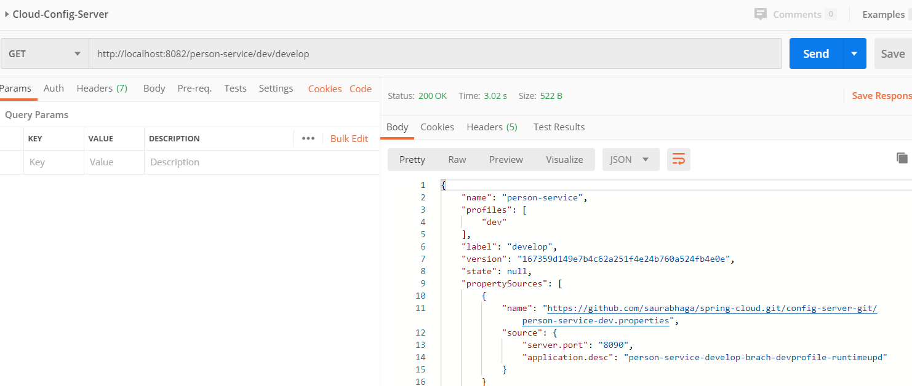

# Cloud Config Server with Spring Boot

### This article will explain the need and implemenation of cloud config server in microservices with Spring Boot.

We all know that no one would like to do the hardcoding of configurations like database details, port etc so Cloud config server solves this problem where the configurations can be managed seperately outside code base in git repository (other options are also available like using database).  At first, it looks very complicated but Spring took away all the complexity and we just need to add couple of dependencies along with some annotations and we are all set with our cloud config server.

Spring Cloud Config server alternative is HashiCorp's Consul key value pair.

## Key points to understand.
- Spring Cloud config server is being used to configure the properties. 
- Properties can be stored in git which can be secured.
- We can configure the git branch, profile from where to read the data.
- One of the finest example of cloud config is server port. It is not advisable to hardcode the port in boot app itself as we may need to run app on different ports in different lifecycles

**There are 2 parts –**

1. Cloud config server 
2. Any service which is using cloud server to read its configuration at runtime.


# Cloud Config Server using Git Repository

**Step1 – Lets set up git directory**

- Create a git repo where the configurations will be saved. 
- You can create files at root location of git (means separate repo for git) or can be inside any folder of git. 
- If you create files under folder of git repo, you need to define the search path property in cloud config server.
- 
In this example. lets assume there is a Git repo with name "spring-cloud-microservices" and there is a folder inside it with name `config-files`. Lets create two files under config-files folder in both master and develop branch
 
```
application.properties
person-service-prod.properties
```

**Sample Content of file**
```
server.port=8090
application.desc=person-service-develop-brach-devprofile-runtime - updated
```
> Name of file will be in the format of  {service name of consuming service}-{active profile}.properties.

### Step 2 Create Config Server Application

Create a spring boot project and add "Config Server" dependency by adding `implementation 'org.springframework.cloud:spring-cloud-config-server'` under dependencies section of build.gradle file.

Configure below in `application.properties` 

```
server.port= 8081
spring.application.name=Cloud Config Server

#git repo .This is the url we used to clone 
spring.cloud.config.server.git.uri= https://github.com/saurabhaga/spring-cloud-microservices
# if any error it will throw on server start else on first request
spring.cloud.config.server.git.clone-on-start=true

# git repo credentials only if git repo is private 
spring.cloud.config.server.git.username= saurabhaga
# password has to be personal token as password authentication is removed on Aug 13, 2021 by git. Refer below sections for more details
spring.cloud.config.server.git.password= ********* 

# skil ssl verification
spring.cloud.config.server.git.skip-ssl-validation=true

# This is required if your files under folder. In this example, it is not at root of git repo so add the folder name in search path.
spring.cloud.config.server.git.search-paths=config-files

# This is required if you want to change default branch. Default branch is the branch which you set default in your repo. in bitbucket it is main
spring.cloud.config.server.git.default-label=develop

```

- Open main class and add `@EnableConfigServer` annotation.
- Run the main program. Application will run on 8081 as we configured it in application.properties

### Note:  Support for password authentication was removed on August 13, 2021. Please use a personal access token instead.  So we need to get the personal token and use it in spring.cloud.config.server.git.password property. In order to get the personal token, 
 a) login in your gitHub folow this path: Settings > Developer settings > Personal access tokens > Generate new token
 
 b)  Now set a long time to expiration token, check the "repo" to allow access repository with this token, and Generate token.
### Verification
- We can check that server is up and can see the files using 
- http://localhost:8081/person-service/dev/master
-  http://localhost:8081/[[name of spring app whose files are]]/[[active priofile]]/[[optional branch]]
- If branch is not provided, default is master
- Any changes done in git is reflected in real time on config server

Sample Output 



# Cloud Config Server using Database
If the requirement is to use relational databse to store properties instead of Git, that option is also available. To do this, you need to follow below steps
- Add `implementation 'org.springframework.boot:spring-boot-starter-data-jdbc'` and `runtimeOnly 'com.h2database:h2' // change it as per actual db`under dependencies section of build.gradle file 
- Define Database details in application.properties file (change db url, credentials)
```
spring.datasource.url=jdbc:h2:mem:testdb
spring.datasource.driverClassName=org.h2.Driver
spring.datasource.username=sa
spring.datasource.password=
spring.jpa.database-platform=org.hibernate.dialect.H2Dialect
spring.profiles.active=jdbc
spring.jpa.show-sql=true
```
- Spring active profile has to be  **jdbc**
- Create a table in defined database with name PROPERTIES and columns as APPLICATION, PROFILE, LABEL, KEY and VALUE as Varchar
- Sample Create and Insert Queries are below 
```
CREATE TABLE PROPERTIES(
APPLICATION VARCHAR(255) NOT NULL,
PROFILE VARCHAR(255) NOT NULL,
LABEL VARCHAR(255) ,
KEY VARCHAR(255) NOT NULL,
VALUE VARCHAR(255) NOT NULL
);
INSERT INTO PROPERTIES (application , profile, label, key, value) VALUES ('test-service', 'prod', 'master-branch','key1', 'prod-value1');
INSERT INTO PROPERTIES (application , profile, label, key, value) VALUES ('test-service', 'prod', 'master-branch','key2', 'prod-value2');
INSERT INTO PROPERTIES (application , profile, label, key, value) VALUES ('test-service', 'dev', 'develop-branch', 'key1', 'dev-value1');
INSERT INTO PROPERTIES (application , profile, label, key, value) VALUES ('test-service', 'dev', 'develop-branch', 'key1', 'dev-value2');
```

**Verification**

Test by accessing below urls
```
http://localhost:8080/test-service/dev/develop-branch
http://localhost:8080/test-service/prod/master-branch
```
**Note: Table and column names can be configured in application.properties using `spring.cloud.config.server.jdbc.sql` property like**

```
spring.cloud.config.server.jdbc.sql= SELECT KEY, VALUE from SERVICE_PROPERTIES where APPLICATION=? and PROFILE=? and LABEL=?
```

**Note** - Specify the default branch (more generally, Git label) that a config server uses if a client does not specify the label using below properties
spring.cloud.config.server.git.default-label=develop

## References :
[Official Documentation](https://docs.spring.io/spring-cloud-config/docs/current/reference/html/)

[Sample Implementation](https://github.com/saurabhaga/spring-cloud-microservices/tree/develop/ConfigServer/)


[Back to Home Page](../)
